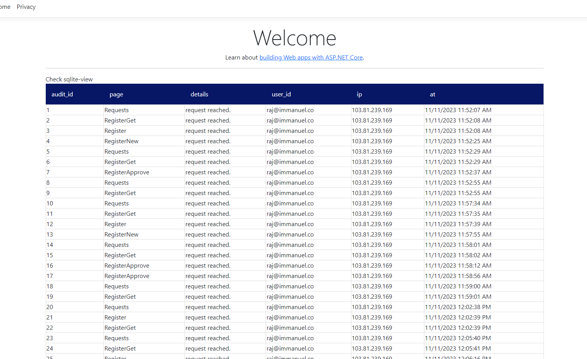

# Ark.TagHelper

## Simple c# library to enable sqlite view query usage much simple & fast using tag helper

nuget install:
[](https://www.nuget.org/packages/Ark.TagHelper)
````
    NuGet\Install-Package Ark.Sqlite
````

1. Included sqlite-view - TagHelper

````
    use below code in DI registration at library level
        builder.Services.AddArkView();

    use below in _ViewImports.cshtml
        @addTagHelper *, Ark.Sqlite

    use below in the *.cshtml
        @using Ark.View;
        below html content will render as table
        <sqlite-view Connection-String="church.db" data-qry="select * from audit_log;"></sqlite-view>
````

- all the columns in the querywill be listed as below

    = attributes
        - connection-string: sqlite db file relative path
        - data-qry: sqlite query to fetch the data

PREVIEW


TO DOs:

- enable socket to listen to chagnes and auto refresh
