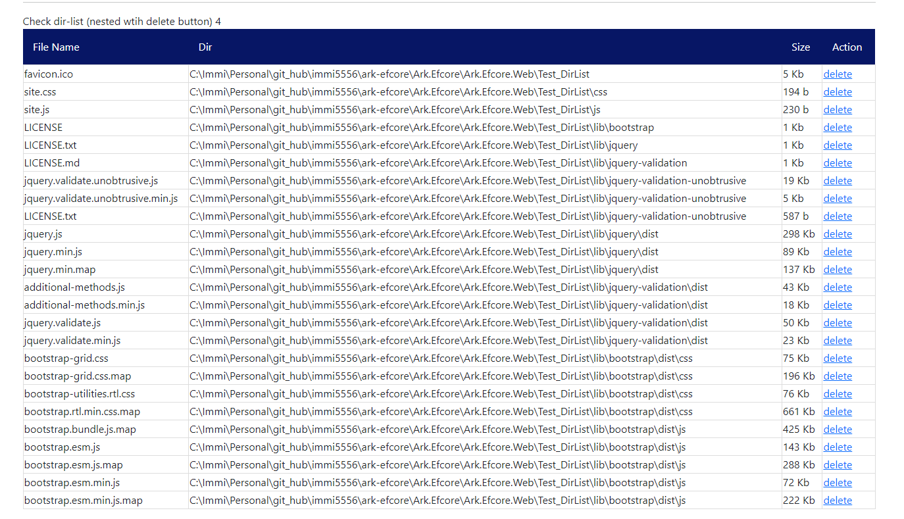

# Ark.TagHelper

## Simple c# library to enable sqlite view query usage much simple & fast using tag helper

nuget install:
[](https://www.nuget.org/packages/Ark.TagHelper)
````
    NuGet Install-Package Ark.TagHelper
````

1. sqlite-view - TagHelper

````
    use below code in DI registration at library level
        builder.Services.AddArkView();

    use below in _ViewImports.cshtml
        @addTagHelper *, Ark.TagHelper

    use below in the *.cshtml
        @using Ark.View;
        below html content will render as table
        <sqlite-view Connection-String="church.db" data-qry="select * from audit_log;"></sqlite-view>
````

- all the columns in the querywill be listed as below

    - attributes
        - connection-string:(mandatory) sqlite db file relative path
        - data-qry:(mandatory) sqlite query to fetch the data

PREVIEW


2. dir-list - TagHelper

````
    use below code in DI registration at library level
        builder.Services.AddArkView();

    use below in _ViewImports.cshtml
        @addTagHelper *, Ark.TagHelper

    use below in the *.cshtml
        @using Ark.View;
        below html content will render as table based on the dir-path provided
        <dir-list dir-path="Test_DirList" nested="true" deletable="true"></dir-list>
````

- all files content will be listed as table

    - attributes
        - dir-path:(mandatory) directory relative path,
        - nested: (optional: false) default, only the root folder content, if true - all the nested folders content will be listed
        - deletable: (optional: false) default, delete action not shown. 

PREVIEW


Styles:
    - this is a simple inline css
    - 

TO DOs:

- enable socket to listen to chagnes and auto refresh
- dir-list, enable pattern filtering
- enhance css extendable
- table lazy loading
- large dataset load
- show/hide columns

expected issue:

- large dataset perf issues